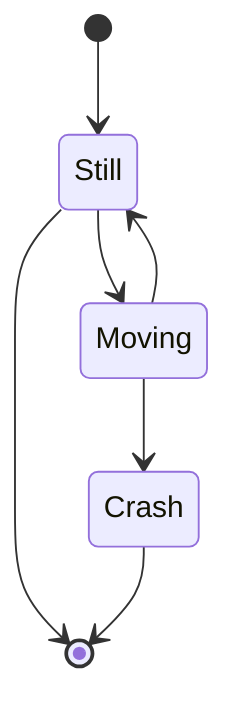

# Dynamic Multiple Datasource 적용 해보기
{: .no_toc}

## Talble of contents
{: .no_toc .text-delta}

1. TOC
{:toc}

---

내가 이걸 사용하게 된 이유

AbstractRoutingDataSource 의 정의

AbstractRoutingDataSource 의 코드 내용 분석

## 

---

https://docs.spring.io/spring-framework/docs/current/javadoc-api/org/springframework/jdbc/datasource/lookup/AbstractRoutingDataSource.html
