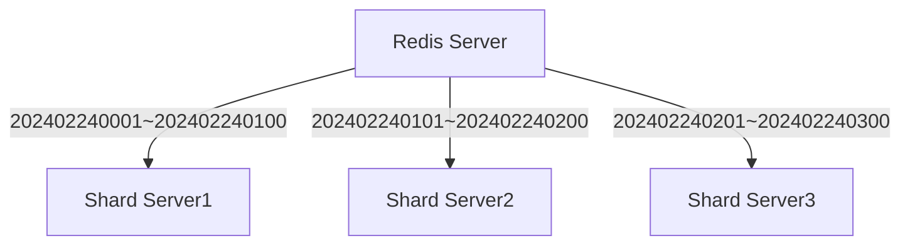
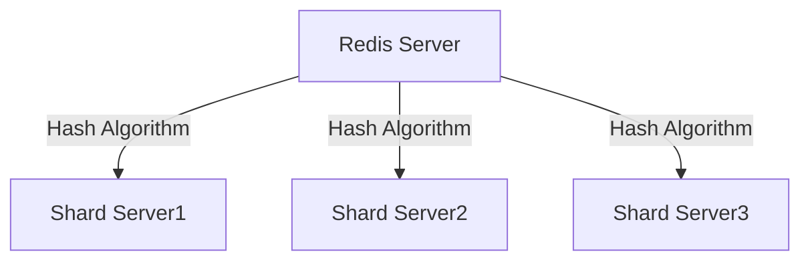
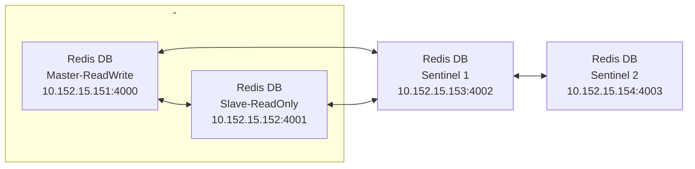

빅데이터 플랫폼 중에 하나인 Redis는 초당 5~10만건 이상의 데이터를 빠르게 쓰고 읽을 수 있도록 Scale-Out 기능인 Partitioning을 제공하는 데이터 분산 처리 시스템 입니다.
기존의 관계형 DBMS에서도 데이터 분산처리를 위해 Striping과 Partitioning 기법을 제공하지만 이는 하나의 논리적 데이터 구조인 테이블을 여러개의 물리적 디스크 장치에 분산 저장하는 개념이었습니다.
이와 같이 하나의 서버 내에서 시스템 자원을 최대한 확장하여 데이터를 저장관리하는 기술을 Scale-Up이라고 합니다.
이와는 달리 Scale-Out은 하나의 논리적 테이블을 수대~수십 대의 서버로 분산 저장하는 개념이며 데이터를 분리 저장하는 목적은 동일하지만 분산 방법은 완전히 다르다고 할 수 있습니다.

이렇게 데이터를 분산 저장하는 목적은 무엇일까요?

1. 자원 공유

  하나의 서버에서 사용할 수 있는 시스템 자원(CPU, Memory, Disk)은 매우 제한적인데 초당 5만~10만 건 이상의 데이터가 일시적으로 발생하게 되면 순간적인 과부하가 발생하게 됩니다.
  이 경우 하나의 서버 자원으로는 이를 한번에 처리할 수 없지만 다른 서버의 자원을 함께 활용할 수 있다면 동시에 빠른 처리가 가능할 것입니다.

2. 성능 향상

  하나의 서버에 지속적인 쓰기 작업을 수행할 때 해당 서버가 이를 처리할 수 있는 용량에는 한계가 있을 것입니다. 이와같은 경우은 연속적으로 발생하는 데이터들을 처리되지 못하게 되면 일시적인 대기 상태에 놓일 수밖에 없고 이는 시스템 전체의 성능을 지연시키게 될 것입니다.
  이와같은 경우는 연속적으로 발생하는 데이터들을 처리되지 못하게 되면 일시적인 대기 상태에 놓일 수밖에 없고 이는 시스템 전체의 성능을 지연시키게 될 것입니다.
  이때 다른 서버에 연속적으로 데이터를 저장할 수 있도록 해준다면 이 문제를 피할 수 있을 것입니다. 이를 Load Balancing이라고 합니다.

3. 안정성

  데이터를 여러 대의 서버에 분산 저장하는 방법을 통해 빅데이터의 빠른 쓰기와 읽기가 가능하지만 만약 특정 서버에 예기치 못한 장애가 발생하게 된다면 데이터 처리 도중에 데이터가 유실될 수도 있을 것 입니다.
  이와 같은 현상이 발생하더라도 안전하게 데이터를 복구할 수 있어야 하는데 이를 위한 솔루션이 복제 시스템입니다. 복제 서버는 분산 서버에 장애가 발생하는 경우 실시간으로 데이터를 복제해 두었다가 장애가 발생한 서버를 대체하여 작동되는 서버입니다.

Redis 서버는 Master-Slave, Master-Slave-Sentinel, Partition-Cluster 기능을 통해 데이터를 복제하고 분산 처리할 수 있습니다.

# Partition 유형

1. Range Partition

Redis 서버에 저장되는 Key 값을 기준으로 특정 범위의 데이터들을 특정 파티션 서버로 분산 저장해주는 개념입니다.
예를 들어, Key Value 202402240001~202402240100은 첫번째 샤드 서버1에, 202402240101~202402240200은 두번째 샤드 서버에 맵핑 시켜 저장하는 방식입니다.

2. Hash Partition

Range Partition의 장점은 사용자가 지정한 서버로 특정 범위 값을 저장할 수 있다는 것입니다.

Redis 서버에서 데이터를 분산 처리할 수 있는 방법에 2가지 유형이 있는데 첫 번째 방법은 Range Partition이고 두 번째 방법은 Hash Partition입니다.
각 유형에 대하여 자세히 알아보겠습니다.

## 1. Range Partition

분산 서버는 최소 2대부터 운영 가능합니다.
하지만 하나의 서버에 장애가 발생하는 경우 지속적으로 분산 처리할 수 없기 때문에 적정 3대 서버 이상을 권장합니다.
이 경우에는 최소 한대 서버에 장애가 발생한다 하더라도 남은 2대 서버로 연속적인 분산 처리가 가능하기 때문입니다.
최초 서버 대수를 몇 대로 구축할 것인지 결정하는 것은 범위 파티션 방식에서는 매우 중요한데 그 이유는 특정 범위의 Key-value를 어느 서버에 저장할 것인지를 사용자가 사전에 결정해야 하기 때문입니다.
좀 더 쉽게 설명하면 Redis 서버에 저장되는 Key 값을 기준으로 특정 범위의 데이터들을 특정 파티션 서버로 분산 저장해주는 개념입니다.
예를 들어 Key Value 202402240001~202402240100은 첫번째 샤드 서버1에, 202402240101~202402240200은 두번째 샤드 서버에 맵핑 시켜 저장하는 방식입니다.
이와 같은 개념의 서버 환경을 분산 시스템이라고 합니다.

## 2.Hash Partition

범위 파티션의 장점은 사용자가 저장한 서버로 특정 범위 값을 저장할 수 있다는 것입니다.
하지만 이 경우 사용자가 직접 설계하다 보면 각 분산 서버에 저장되는 데이터 양과 분산 정도가 현저히 떨어지는 경우가 발생할 수 있습니다.
예를 들어, 첫번째 분산 서버에는 데이터가 80만 건 저장되고 두번째 서버에는 10만 건, 세번째 분산 서버에는 30만 건 저장되는 상태가 발생할 수 있다는 것입니다.
Hash Partition은 Hash Algorithm에 의해 총 120만 건의 데이터를 각 서버 당 40만건씩 골고루 분산 저장해주는 개념입니다.

# Partition 구현 방법

| 구분                       | 용도                                                                                                  |
|--------------------------|-----------------------------------------------------------------------------------------------------|
| Client Side Partitioning | 이 방법은 데이터를 쓰고 읽는 클라이언트에서 해당 서버를 직접 지정하여 처리하는 방법 입니다. Redis 서버를 이용하는 대부분의 시스템 환경에서 보편적으로 사용되는 방법입니다. |
| Proxy Assisted Partitioning                       | 클라이어트는 Proxy Protocol로 구축된 Proxy Server를 통해 쓰고 읽기 작업에 대한 요청을 수행하고 그 결과를 전달받는 방법입니다. Redis와 Memcached는 Twemproxy를 통해 보조 파티셔닝 시스템을 구현합니다.                                                                                                   |
|Query Router Partitioning|쓰고 읽기 작업을 수행하면 임의의 서버로 전딜되며 데이터를 참조할 수 없는 경우에는 올바른 노드로 Redirect 시켜주는 방법입니다.|

Redis Server 환경에서 데이터를 분산 처리 할 수 있는 방법에는 3가지가 있습니다.
첫 번째 방법은 Client Side Partitioning이고 두 번째 방법은 Proxy Assisted Partitioning이며 세 번째 방법은 Query Router Partitioning입니다.
각 방법에 대하여 자세히 알아보겠습니다.

## 1. Client Side Partitioning

여러 대의 분산 서버를 구축할때 각 서버에 저장될 데이터의 성격과 데이터 양을 사용자가 직접 설계하고 결정하는 방법입니다.
가장 원초적인 분산 방법이지만 가장 정확한 분산 방법이기도 합니다.
일반적인 데이터 분산은 서버에서 제공하는 자동화 메커니즘에 의해 사용자의 의도와 관계없이 특정 서버로 저장되기 때문에 사용자가 개입할 수 없습니다.
사용자가 분산 기술 및 설계 능력이 부족한 경우에 효과적일 수 있겠지만 사용자의 의도대로 설계하고 싶은 경우에는 오히려 불편할 수도 있을 것입니다.

## 2. Proxy Assisted Partitioning

Client Side Partitioning은 모든 것을 사용자가 직접 설계하고 구현해야 합니다.
하지만 이와 같은 구현 방법은 모든 기술에 대한 이해와 설계 능력이 있어야 구현가능 하기 때문에 결코 쉬운 방법이 아닙니다.
Proxy Assisted Partitioning 방식에서는 분산 서버 이외에 별도로 Proxy Server를 구축하여 Proxy Server가 추가로 필요합니다.
사용자는 대량의 데이터를 입력할 때 어떤 분산 서버의 데이터 양이 가장 적은 지, 어떤 서버의 분산율이 가장 나쁜지 알 필요도 없습니다.
Proxy Server는 현재 분산 서버의 모든 상태 정보를 수집 및 저장해 주며 사용자가 대량의 데이터에 대한 저장을 요구하는 경우 가장 적절한 분산 서버를 찾아서 데이터를 저장해 줍니다.
또한 사용자가 특정 데이터를 검색하는 명령어를 실행하면 해당 데이터가 저장되어 있는 서버 정보를 분석한 후 데이터를 검색하고 결과를 리턴해 줍니다.
Proxy Server는 별로의 분리된 서버에 구축하는 것을 권장합니다.
이 방식은 Redis Server에서 기본적으로 제공하지 않으며 Twemproxy Cluster와 같은 오픈 소스와 연동해서 구축해야 합니다.

## 3. Query Router Partitioning

데이터를 분산 저장해 주며 특정 분산 서버에 장애가 발생한 경우 사용 가능한 Slave 서버를 통해 지속적인 읽기 작업이 가능하고 사용 가능한 서버로 자동 전환(Recovery)해 주는데 오픈소스로 제공하는 redis-rb 또는 Predis 솔루션을 통해 구현할 수 있습니다.

## Redis Partition의 단점

1. Redis Server 환경에서 Partitioning 기능을 이용한 분산 처리 기술의 사용은 적극적으로 권장하지 않습니다.
만약, 2개의 데이터 세트가 여러 개의 인스턴스에 동시에 저장되어 있는 경우 이를 효과적으로 처리하고 트랜젝션 제어까지 수행하는 것은 결코 쉬운 작업이 아니며 이를 완벽하게 지원하지 않기 때문입니다.
 
2. 새로운 노드를 추가하고 기존 노드를 실 시간으로 제거하는 작업은 하나의 큰 파티션 영역을 새롭게 분할하고 합병하는 작업이 빈번하게 요구되는데 이 경우 RDB와 AOF 파일을 백업하고 이전해야 하기 때문에 이 작업들은 결코 쉬운 방법이 아닙니다.

3. 런타임 시 노드 추가와 제거 작업이 수행되는 단계에서 전체 서버의 균형을 맞추기 위한 Rebanlancing 작업을 수행해야 하는데 이를 처리하다 보면 성능 지연 문제 및 예기치 못한 기술적 한계가 발생할 수 있습니다.

# Master & Slave & Sentinel

## 시스템 설정

Redis 서버에서 제공하는 가장 기본적인 복제 시스템은 Master-Slave 서버 또는 Master-Slave-Sentinel 서버 구성입니다.

### Master-Slave 복제 시스템

사용자 데이터를 실시간으로 처리(입력, 수정, 삭제, 조회)할 수 있는 마스터 서버 1대에 대해 슬레이브 서버는 마스터 서버의 데이터가 실시간으로 복제됩니다.
슬레이브 서버는 마스터 서버에 의해서 만 쓰기작업을 수행할 수 있고 사용자는 오직 읽기 작업만 수행할 수 있습니다.
마스터 서버에 예기치 못한 장애가 발생하는 경우 슬레이브 서버는 마스터 서버로 자동 전환(FailOver)되지 않으며 사용자는 슬레이브 서버에 복제된 데이터를 이용하여 마스터 서버를 복구 할 수는 있습니다.
마스터 서버에 장애가 발생하ㄴ슨 경우에도 슬레이브 서버에 대해서는 지속적인 읽기 작업을 수행할 수 있습니다.

### Master-Slave-Sentinel 복제 시스템

두번째 복제 시스템은 마스터-슬레이브-센티넬 서버 환경 입니다.
마스터-슬레이브 환경에서 마스터 서버에 장애가 발생하더라도 슬레이브 서버를 통해 지속적인 읽기 작업을 수행할 수 있지만 쓰기 작업을 수행할 수 없기 때문에 일시적인 서비스 중단이 발생할 수 밖에 없습니다.
이와 같은 문제점을 해결하기 위해서는 슬레이브 서버를 마스터 서버로 전환시켜 지속적인 쓰기 및 읽기작업이 가능하도록 해야 합니다.
이를 위해서는 센티널 서버를 추가로 구축해야 합니다.
센티널 서버는 일상적인 어무 환경에서는 마스터 서버와 슬레이브 서버를 지속적으로 모니터링 하다가 마스터 서버에 장애가 감지된 경우 슬레이브 서버를 즉시 마스터 서버로 자동 전환시켜 데이터 유실이 발생하지 않도록 Fail-Over해 줍니다.

센티설 서버에는 사용자 데이터가 저장되지 않으며 오직 마스터 서버와 슬레이브 서버의 장애 상태만을 모니터링하는 역할을 수행하기 때문에 좋은 사양의 하드웨어가 요구 되지 않습니다.
또한 원본 센티널 서버에 장애가 발생하는 경우에 대비하여 복제 센티널 서버를 추가로 구성할 수도 있습니다.
안정적인 시스템 구성을 위해서 센티널 서버는 3대를 권장하며 최소 구성은 센티널 서버 1대 입니다.

> 센티널 서버
>
> 1. 원본 데이터 서버에 예기치 못한 장애가 발생하는 경우 데이터가 유실되는 치명적인 상태가 발생할 수 있습니다.
> 이와 같은 현상이 발생하더라도 언제든지 서비스를 수행하기 위해서는 슬레이브 서버로 자동 Fail-Over 해주는 기능이 필요합니다.
> 2. 마스터 서버와 슬레이브 서버가 어떤 상태인지를 거의 실시간으로 HeartBeat를 통해 감시하고 관련 정보를 제공합니다.
> 3. 데이터 서버에 어떤 장애가 발생하는 경우 문자 메시지 또는 이메일 등을 통해 관련 상태 정보를 사용자에게 전달할 수 있습니다.

