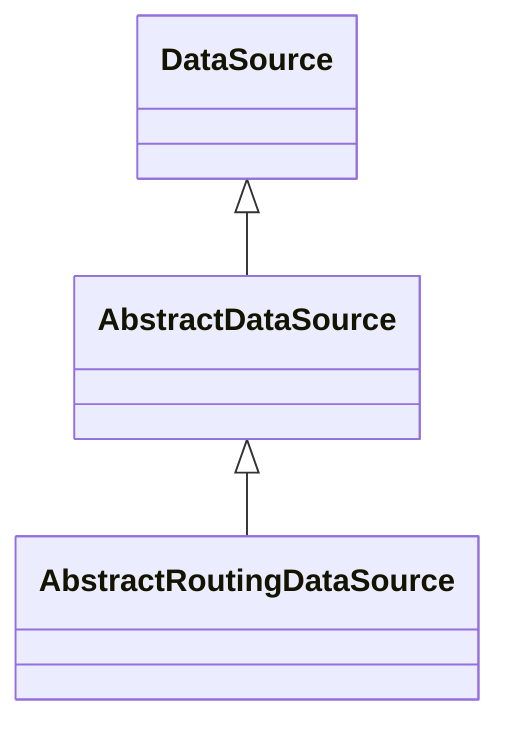

## 언제 사용하는가?

보통 애플리케이션에서는 하나 이상의 데이터베이스를 사용해야 하는 경우가 많습니다. 
예를 들어, 마스터-슬레이브 데이터베이스 구조를 사용하거나, 
여러 개의 데이터베이스 서버를 사용하는 등의 상황에서 다중 데이터 소스를 관리해야 합니다.

하지만 요청이 들어올 때마다 데이터베이스를 동적으로 선택하거나 데이터 소스가 추가되는 경우도 있습니다.
즉 Master/Slave의 DB 분기 처리라던지 Replication DB 처럼 여러 DB를 그때 그때 선택하는 경우가 될 것입니다.

이럴경우 사용이 가능한 방법이 "AbstractRoutingDatasource"를 이용한 "Dynamic Datasource Routing"입니다.

## AbstractRoutingDatasource 란?

"AbstractRoutingDatasource"는 spring 2.0.1 부터 추가 되었으며 spring-jdbc 프로젝트에 포함되어 있습니다.
"DataSource"를 구현한 구현체인데요. 
"javax.sql.DataSource" 인터페이스로 정의가 되어 있습니다.
이 인터페이스는 데이터 베이스와의 연결을 설정하고 얻는데 사용됩니다.



"AbstractRoutingDataSource"의 가장 중요한 특징은 개발자가 "determineCurrentLookupKey()"라는 추상 메소드를 구현하여 
현재 스레드의 컨텍스트에서 사용될 데이터 베이스를 결정한다는 것입니다.
"AbstractRoutingDataSource"에는 여러 메소드들이 있지만 주요한 메소드를 살펴 보겠습니다.

```java
package org.springframework.jdbc.datasource.lookup;

public abstract class AbstractRoutingDataSource extends AbstractDataSource implements InitializingBean {
    
    ...

    @Override
    public Connection getConnection() throws SQLException {
        return determineTargetDataSource().getConnection();
    }
    
    ...

    protected DataSource determineTargetDataSource() {
        Assert.notNull(this.resolvedDataSources, "DataSource router not initialized");
        Object lookupKey = determineCurrentLookupKey();
        DataSource dataSource = this.resolvedDataSources.get(lookupKey);
        if (dataSource == null && (this.lenientFallback || lookupKey == null)) {
            dataSource = this.resolvedDefaultDataSource;
        }
        if (dataSource == null) {
            throw new IllegalStateException("Cannot determine target DataSource for lookup key [" + lookupKey + "]");
        }
        return dataSource;
    }

    @Nullable
    protected abstract Object determineCurrentLookupKey();
}
```

getConnection() 을 살펴 보면 connection을 얻기 위하여 determineTargetDataSource() 메소드를 호출하여 DataSource 객체를
가져오는 것을 확인할 수 있습니다.
determineTargetDataSource() 는 DataSource 를 가져오기 위한 Template Method 입니다.
determineCurrentLookupKey() 메소드를 이용하여 key가 될 객체를 가져오고 이를 활용하여 DataSource를 선택하게 됩니다. 
determineCurrentLookupKey() 메소드는 추상 메소드로 AbstractRoutingDataSource를 구현한 클래스에서 반드시 
구현하여야 합니다.
그렇다면 determineCurrentLookupKey()를 어떻게 구현을 할 것인가? 
간단한 사용 사례로는 현재 사용자의 context의 속성으로 사용을 하는 방법이 있습니다.

## AbstractRoutingDataSource 구현 하기

```java

package io.github.younghwang.dynamicdatasourcerouting;

import org.springframework.jdbc.datasource.lookup.AbstractRoutingDataSource;

public class CustomerRoutingDataSource extends AbstractRoutingDataSource {
    // determineCurrentLookupKey의 구현
    @Override
    protected Object determineCurrentLookupKey() {
        return CustomerDataSourceContextHolder.getContext().getLookupKey();
    }
}

```

AbstractRoutingDatasource를 상속하여 CustomerContextHolder 에서 context 정보를 가져와 다시 
key를 가져오도록 CustomRoutingDataSource 를 구현하였습니다.

## DataSourceLookupKey Function, ContextHolder 구현

LookupKey 를 가져오기 위한 Functional Interface를 구현합니다.
추후 이를 구현하여 key 객체를 구할 수 있도록 합니다.

```java

@FunctionalInterface
public interface DataSourceLookupKeyFunction {

    Object getLookupKey();

}

```

Context 정보를 이용한다고 하였는데 이를 위하여 ThreadLocal 을 이용한 context holder를 구현한다.

```java

import org.springframework.util.Assert;

public class CustomerDataSourceContextHolder {
    private static final ThreadLocal<DataSourceLookupKeyFunction> contextHolder = new ThreadLocal<>();

    public static DataSourceLookupKeyFunction getContext() {
        return contextHolder.get();
    }

    public static void setContext(DataSourceLookupKeyFunction context) {
        Assert.notNull(context, "DataSourceLookupKey cannot be null");
        contextHolder.set(context);
    }

    public static void clearContext() {
        contextHolder.remove();
    }
}

```

이렇게 Dynamic Data Source 를 가져오기 위한 기본적인 구성이 되었습니다.
하지만 아직 CustomerRoutingDataSource 에 DataSource 정보는 없는 상태입니다.
Multiple Data Source 를 가질 수 있도록 해보겠습니다.

## Multiple Data Source 구현

먼저 Data Source 의 정보들이 필요합니다. 
이를 위해 application.yml에 정보를 추가하고 이를 Properties Bean을 등록해 보겠습니다.

```java
// application.yml

server:
    sources:
        MASTER:
            host: localhost
            port: 3306
            user: root
            password: passwd
        SLAVE:
            host: localhost
            port: 4306
            user: root
            password: passwd

```

```java

import org.springframework.boot.context.properties.ConfigurationProperties;
import org.springframework.context.annotation.Configuration;

import java.util.Map;

@Configuration
@ConfigurationProperties(prefix = "server")
public class CustomerDataSourceProperties {
    private Map<String, CustomerDataSourceProperty> sources;

    public Map<String, CustomerDataSourceProperty> getSources() {
        return sources;
    }

    public void setSources(Map<String, CustomerDataSourceProperty> sources) {
        this.sources = sources;
    }

    public static class CustomerDataSourceProperty {
        private String host;
        private String port;
        private String user;
        private String password;

        // getter, setter 구현
    }
}

```

Data Source 정보를 활용하여 CustomerRoutingDataSource 에 DataSource를 등록할수 있도록 Factory를 구성하겠습니다.
이 Factory Class 를 통해 CustomerRoutingDataSource 객체가 생성되게 됩니다.

```java

@RequiredArgsConstructor
public class MainRoutingDataSourceFactory {
    private final Map<Object, Object> dataSourceMap = new ConcurrentHashMap<>();
    private AbstractRoutingDataSource routingDataSource;
    private final  databasePropertyService;

    public DataSource createRoutingDataSource() {
        routingDataSource = new MainRoutingDataSource();
        DataSource defaultDataSource = createDefaultDataSource();
        dataSourceMap.put(MAIN_PROXY_KEY, defaultDataSource);
        routingDataSource.setTargetDataSources(dataSourceMap);
        routingDataSource.setDefaultTargetDataSource(defaultDataSource);
        return routingDataSource;
    }

    /**
     * DataSource 미존재 시 생성하여 dataSourceMap에 추가
     *
     * @param projectInfo
     */
    public void setDataSource(ProjectInfo projectInfo) {
        if (hasDataSource(projectInfo)) return;
        Optional<DatabaseProperty> dataSourceInfo = databasePropertyService.getProperty(projectInfo.getProjectKey());
        DatabaseProperty info = dataSourceInfo.orElseThrow(NoSuchElementException::new);
        DataSource ds = createDataSource(dataSourceInfo.get());
        try (Connection c = ds.getConnection()) {
            info.getProjectKeys().forEach(key -> dataSourceMap.put(key, ds));
            routingDataSource.afterPropertiesSet();
        } catch (SQLException e) {
            throw new RuntimeException(e);
        }
    }

    /**
     * dataSourceMap에 해당 프로젝트의 DataSource가 있는지 확인
     *
     * @param projectInfo
     * @return
     */
    public boolean hasDataSource(ProjectInfo projectInfo) {
        return dataSourceMap.containsKey(projectInfo.getSourceKey());
    }

    /**
     * DataSource 생성
     *
     * @param info
     * @return
     */
    public DataSource createDataSource(DatabaseProperty info) {
        DataSourceProperties dataSourceProperties = new DataSourceProperties();
        dataSourceProperties.setUrl("jdbc:mysql://" + info.getHost() + ":" + info.getPort() + "?serverTimezone=Asia/Seoul");
        dataSourceProperties.setUsername(info.getUser());
        dataSourceProperties.setPassword(info.getPassword());
        dataSourceProperties.setDriverClassName("com.mysql.cj.jdbc.Driver");
        return dataSourceProperties.initializeDataSourceBuilder().type(HikariDataSource.class).build();
    }

    private DataSource createDefaultDataSource() {
        return createDataSource(databasePropertyService.getDefaultDataSource());
    }
}
```

# 참고 문헌

---

https://docs.spring.io/spring-framework/docs/current/javadoc-api/org/springframework/jdbc/datasource/lookup/AbstractRoutingDataSource.html
https://spring.io/blog/2007/01/23/dynamic-datasource-routing
