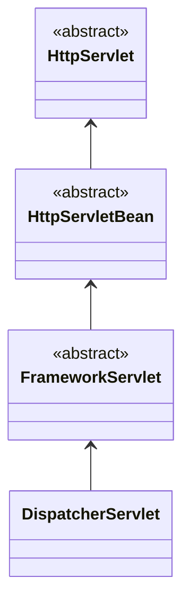

스프링을 사용하여 예외 처리를 구현하는 방법에 대하여 정리한다.
주요 목표는 클라이언트에 사용되는  HTTP **Status Codes**에 애플리케이션의 예외를 매핑하는 것이다.
Spring 3.2 이전에는 Spring MVC 응용 프로그램에서 예외를 처리하기 위한 두 가지 주요 접근 방식으로 *HandlerExceptionResolver*와 *@ExceptionHandler* 이 있었다.
Spring 3.2는 이전 두 솔루션의 한계를 해결하기 위해 새로운 **@ControllerAdvice** 주석을 도입했다.
Spring 5에서는 REST API에 기본적인 오류 처리를 위한 빠른 방법인 ResponseStatusException 클래스가 도입되었다.
이들은 모두 한 가지 공통점을 가지고 있는데, **관심사의 분리**를 매우 잘 따르고 있다는 것이다.
일반적으로 어떤 종류의 장애가 발생했음을 나타내기 위해 예외를 적용할 수 있으며, 이 예외는 다음 중 하나를 통해 처리하게 된다.

# Controller Level에서 @ExceptionHandler

에러를 처리할 방법은 정의하고 @ExceptionHandler 어노테이션을 이용한다.
해당 방법은 @Controller 레벨에서 처리하는 방법이다.

```java
public class GreetingController{
    //...
    @ExceptionHandler({ CustomException1.class, CustomException2.class })
    public void handleException() {
        //...
    }
}
```

이 방식에는 큰 단점이 있다. 
@ExceptionHandler을 이용한 방법은 해당 특정 컨트롤러에 대해서만 활성화되며, 전체 응용 프로그램에 대해서는 전역적으로 활성화되지 않는다. 
그렇다고 동일한 예외 처리를 모든 컨트롤러에 해당 annotation을 이용하여 모두 추가하는 것은 좋지 않다. 
모든 controller가 base controller를 확장하게 하여 해결할 수 있다.
그러나 이 해결책은 애플리케이션에서 여러 불가능한 상황이 발생한다.
예를 들어, 컨트롤러는 이미 다른 기본 클래스에서 확장된 것일 수도 있고, 다른 jar에 있거나 직접적인 수정이 불가능한 경우가 해당될 것이다.

다음으로 전역적인 문제와 컨트롤러와 같은 기존 아티팩트에 대한 변경을하지 않는 다른 방법에 대해 살펴보겠다.

# handlerExceptionResolver를 이용한 방법

HandlerExceptionResolver를 정의하는 방법도 있다.
이를 통해 응용 프로그램에서 발생하는 모든 예외를 해결할 수 있으며 REST API에 동일한 예외 처리 메커니즘을 구현할 수 있다.
Spring에서는 3가지의 HandlerExceptionResolver가 기본적으로 빈으로 등록된다.

## ExceptionHandlerExceptionResolver

Spring 3.1에서 도입 되었다.
이는 앞서 제시한 @ExceptionHandler 메커니즘의 작동 방식을 구성하는 핵심 구성 요소이다.

## DefaultHandlerExceptionResolver

Spring 3.0에 도입 되었다.

이는 대응하는 HTTP 상태 코드, 즉 클라이언트 오류 4xx 및 서버 오류 5xx 상태 코드에 대한 표준 Spring 예외를 해결하는 데 사용된다.
처리하는 Spring 예외의 전체 목록과 상태 코드에 매핑하는 방법은 다음과 같다.
응답의 상태 코드를 올바르게 설정하지만, 한 가지 제한 사항은 응답 본문에 아무것도 설정하지 않는다는 것이다.
REST API의 경우 상태 코드가 클라이언트에 제공하기에 충분하지 않은 정보입니다. 응답 본문이 있어야 애플리케이션이 실패에 대한 추가 정보를 제공할 수 있다.
이는 ModelAndView를 통해 뷰 해상도와 렌더링 오류 콘텐츠를 구성하면 해결할 수 있지만 솔루션이 최적이 아닌 것은 분명하다.
그렇기 때문에 Spring 3.2에서 더 나은 옵션을 추가했다.

## ResponseStatusExceptionResolver

Spring 3.0에 도입 되었다.

주요 업무는 사용자 지정 예외에서 사용 가능한 @ResponseStatus 주석을 사용하고 이러한 예외를 HTTP 상태 코드에 매핑한다.

# HandlerExceptionResolver들이 어떻게 Bean으로 등록되는가?

그렇다면 어떻게 HandlerExceptionResolver 들이 빈으로 등록이 되는지 살펴 보겠다.
Spring MVC의 자동 설정인 WebMvcAutoConfiguration을 먼저 살표보자.

```java
package org.springframework.boot.autoconfigure.web.servlet;

@AutoConfiguration(after = { DispatcherServletAutoConfiguration.class, TaskExecutionAutoConfiguration.class,
		ValidationAutoConfiguration.class })
@ConditionalOnWebApplication(type = Type.SERVLET)
@ConditionalOnClass({ Servlet.class, DispatcherServlet.class, WebMvcConfigurer.class }) // 1 
@ConditionalOnMissingBean(WebMvcConfigurationSupport.class) // 2 
@AutoConfigureOrder(Ordered.HIGHEST_PRECEDENCE + 10)
@ImportRuntimeHints(WebResourcesRuntimeHints.class)
public class WebMvcAutoConfiguration {

    //...
    
	@Configuration(proxyBeanMethods = false)    // 3
	@Import(EnableWebMvcConfiguration.class)    // 4 
	@EnableConfigurationProperties({ WebMvcProperties.class, WebProperties.class })
	@Order(0)
	public static class WebMvcAutoConfigurationAdapter implements WebMvcConfigurer, ServletContextAware {
	    //...
    }
    
  	@Configuration(proxyBeanMethods = false)    // 5
	@EnableConfigurationProperties(WebProperties.class)
	public static class EnableWebMvcConfiguration extends DelegatingWebMvcConfiguration implements ResourceLoaderAware {    // 6
	    //...

        // 7
		@Override
		protected ExceptionHandlerExceptionResolver createExceptionHandlerExceptionResolver() {
			if (this.mvcRegistrations != null) {
				ExceptionHandlerExceptionResolver resolver = this.mvcRegistrations
					.getExceptionHandlerExceptionResolver();
				if (resolver != null) {
					return resolver;
				}
			}
			return super.createExceptionHandlerExceptionResolver();
		}

	    //...
    }
    
    //...  
}
```

```java
package org.springframework.web.servlet.config.annotation;

public class WebMvcConfigurationSupport implements ApplicationContextAware, ServletContextAware { // 8

    //...
    
    // 9
    @Bean
	public HandlerExceptionResolver handlerExceptionResolver(
			@Qualifier("mvcContentNegotiationManager") ContentNegotiationManager contentNegotiationManager) {
		List<HandlerExceptionResolver> exceptionResolvers = new ArrayList<>();
		configureHandlerExceptionResolvers(exceptionResolvers);
		if (exceptionResolvers.isEmpty()) { // 10 
			addDefaultHandlerExceptionResolwers(exceptionResolvers, contentNegotiationManager); // 11 
		}
		extendHandlerExceptionResolvers(exceptionResolvers);
		HandlerExceptionResolverComposite composite = new HandlerExceptionResolverComposite();
		composite.setOrder(0);
		composite.setExceptionResolvers(exceptionResolvers);    // 15 
		return composite;
	}
	
	// 실제 적인 default handlerExceptionResolvers instance 생성
	// List<HandlerExceptionResolver> 에 생성된 instances 삽입
	protected final void addDefaultHandlerExceptionResolvers(List<HandlerExceptionResolver> exceptionResolvers,
			ContentNegotiationManager mvcContentNegotiationManager) {

		ExceptionHandlerExceptionResolver exceptionHandlerResolver = createExceptionHandlerExceptionResolver(); // 12 
		
		//...

		ResponseStatusExceptionResolver responseStatusResolver = new ResponseStatusExceptionResolver(); // 13
		responseStatusResolver.setMessageSource(this.applicationContext);
		exceptionResolvers.add(responseStatusResolver);

		exceptionResolvers.add(new DefaultHandlerExceptionResolver());  // 14
	}

	
	//...
}
```
먼저 WebMvcAutoConfiguration이 작동하기 위해서는 아래의 조건이 만족되어야 한다.

1. Servlet.class, DispatcherServlet.class, WebMvcConfigurer.class 가 클래스 로더에 존재하여야 한다.
2. WebMvcConfigurtionSupport clsss가 bean으로 등록되지 않아야 한다.

inner class로 EnableWebMvcConfiguration 를 선언하고 있다.
해당 클래스는 DelegatingWebMvcConfiguration을 상속하고 있으며 이는 또 다시 WebMvcConfigurationSupport를 상속하고 있음을 확인할 수 있다.

그 다음 각각의 라인의 의미를 살펴보면 아래와 같다.

3. WebMvcAutoConfigurationAdapter inner class 에 @Configuration annotaion을 이용하여 빈 설정 클래스로 선언하고 있다.
4. 그리고 @Import annotation으로 EnableWebMvcConfiguration.class 를 import하고 있는데 이 또한 WebMvcAutoConfiguration class 내에 존재한다.
5. EnableWebMvcConfiguration inner class 에 @Configuration annotation으로 빈 설정 클래스 이다.
6. EnableWebMvcConfiguration은 DelegatingWebMvcConfiguration을 상속하고 있다.
7. createExceptionHandlerExceptionResolver()을 override 하여 ExceptionHandlerExceptionResolver 객체를 생성한다.
8. DelegatingWebMvcConfiguration은 WebMvcConfigurationSupport를 상속하고 있다.
9. handlerExceptionResolver() 메소드에서 HandlerExceptionResolver bean을 생성한다.
10. exceptionResolvers property 가 empty면 실행 default HandlerExceptionResolver 들을 생성한다.
11. addDefaultHandlerExceptionResolwers() 메소드를 호출하여 default HandlerExceptionResolver를 생성하고 exceptionResolvers에 리스트 형태로 담는다.
12. 7번에서 override 한 메소드를 이용하여 ExceptionHandlerExceptionResolver 객체를 생성한다.
13. ResponseStatusExceptionResolver 객체를 생성 한다.
14. DefaultHandlerExceptionResolver 생성를 생성 한다.
15. HandlerExceptionResolverComposite 객체에 composite 패턴을 이용하여 빈으로 등록한다.

이러한 일련의 과정을 통하여 handlerExceptoinResolver 객체들이 빈으로 등록되게 된다.

# handlerExceptoinResolver들은 어떻게 동작하는가?

hanlderExceptionResolver가 빈으로 등록이 완료되었고 애플리케이션이 실행될 때 어떻게 실행이 되는지 살펴보도록 하겠다.
MVC를 기준으로 살펴보기에 DispatcherServlet에서의 동작을 확인한다.



앞서 살펴본 WebMvcAutoConfiguration class를 보면 '@AutoConfiguration(after = { DispatcherServletAutoConfiguration.class, ... })' 이 선언된 것을 확인할 수 있다.
즉 WebMvcAutoCongfiguration 설정이 이루어지기 전에 DispatcherServletAutoConfiguration.class 의 빈 설정이 먼저 진행 되어 DispatcherServlet이 빈으로 등록되게 된다.
DispatcherServlet은 Servlet이 기에 사용자의 요청이 최초로 들어올때 init() 메소드를 통한 초기화가 이루어지게 된다.

```java
public abstract class HttpServletBean extends HttpServlet implements EnvironmentCapable, EnvironmentAware {
	//...
	
	@Override
	public final void init() throws ServletException {
        //...

		// Let subclasses do whatever initialization they like.
		initServletBean();  // 1
	}
	
    protected void initServletBean() throws ServletException {  // 2
	}

	//...
}

public abstract class FrameworkServlet extends HttpServletBean implements ApplicationContextAware {
	@Override
	protected final void initServletBean() throws ServletException {    // 3
        //...
		try {
			this.webApplicationContext = initWebApplicationContext();   // 4
			initFrameworkServlet();
		}
		catch (ServletException | RuntimeException ex) {
			logger.error("Context initialization failed", ex);
			throw ex;
		}
		//...
	}
	
    protected WebApplicationContext initWebApplicationContext() {
		WebApplicationContext rootContext =
				WebApplicationContextUtils.getWebApplicationContext(getServletContext());
		WebApplicationContext wac = null;

        //...
        
		if (!this.refreshEventReceived) {
			// Either the context is not a ConfigurableApplicationContext with refresh
			// support or the context injected at construction time had already been
			// refreshed -> trigger initial onRefresh manually here.
			synchronized (this.onRefreshMonitor) {
				onRefresh(wac); // 5
			}
		}
		
        //...

		return wac;
	}

	protected void onRefresh(ApplicationContext context) {  // 6
		// For subclasses: do nothing by default.
	}

	//...
}

@SuppressWarnings("serial")
public class DispatcherServlet extends FrameworkServlet {
    //...
    
	@Override
	protected void onRefresh(ApplicationContext context) {  // 7
		initStrategies(context);
	}

	protected void initStrategies(ApplicationContext context) { 
	    //...
		initHandlerExceptionResolvers(context); // 8
	    //...
	}

	private void initHandlerExceptionResolvers(ApplicationContext context) {
		this.handlerExceptionResolvers = null;

		if (this.detectAllHandlerExceptionResolvers) {  // 9
			// Find all HandlerExceptionResolvers in the ApplicationContext, including ancestor contexts.
			Map<String, HandlerExceptionResolver> matchingBeans = BeanFactoryUtils
					.beansOfTypeIncludingAncestors(context, HandlerExceptionResolver.class, true, false); // 10
			if (!matchingBeans.isEmpty()) {
				this.handlerExceptionResolvers = new ArrayList<>(matchingBeans.values()); // 11
				// We keep HandlerExceptionResolvers in sorted order.
				AnnotationAwareOrderComparator.sort(this.handlerExceptionResolvers);
			}
		}
		else {
		    //...
		}
		
		//...
	}
	
	//...
}
```

1. Servlet init() 메소드 실행 시 initServletBean() 호출된다.
2. initServletBean() 메소드는 추상 메소드로 HttpServletBean 클래스 상속 시 구현 필요하다.
3. initServletBean() 메소드는 FrameworkServlet 클래스에서 구현되어 있다.
4. initServletBean() 메소드를 살펴보면 initWebApplicationContext() 메소드를 호출한다.
5. initWebApplicationContext()에서 refreshEventReceived 변수가 false 이면 onRefresh() 메소드가 호출된다.
6. onRefresh()는 추상 메소드로 선언된것을 확인가능하다.
7. DispatcherServlet 에서 onRefresh() 메소드가 구현되어 있다. initStrategies() 메소드만을 호출한다.
8. initStrategies()에서는 여러 메소드를 호출하고 있는데 그중 initHandlerExceptionResolvers() 메소드를 살펴본다.
9. initHandlerExceptionResolvers() 메소드에서 detectAllHandlerExceptionResolvers 변수가 true일 경우를 확인해본다.
10. 'BeanFactoryUtils
    .beansOfTypeIncludingAncestors(context, HandlerExceptionResolver.class, true, false)' 메소드는 HandlerExceptionResolver.class를 구현한 객체를 가져온다.
11. matchingBeans.values()로 handlerExceptionResolvers 변수에 HandlerExceptionResolver 인스턴스들을 할당한다.

이렇게 DispatchServlet에서 HandlerExceptionResolver 들이 주입되는것도 확인하였다.

# 마무리

지금까지 스프링에서 사용하는 HandlerExceptionResolever의 간단히 종류와 역할에 대해서 살펴보았다.
또한 이러한 Resolver들이 어떻게 Bean으로 등록이 되고 DispatchServlet에 어떻게 주입이 되는지 까지도 보았다.
스프링에서 Composite Pattern 패턴 이나 Tempate Method 패턴을 어떻게 활용하고 있는지도 살펴 볼수 있었다.
다음에는 이 문서의 후속으로 어떻게 Controller에서 Exception을 핸들링하는지 HandlerExceptionResolver에서 어떻게 Exception을 확인하는지 알아보겠다.
