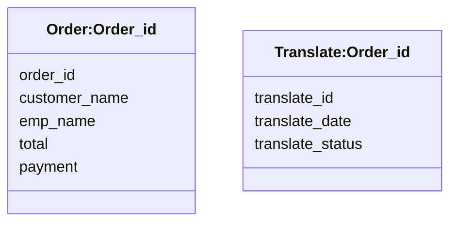
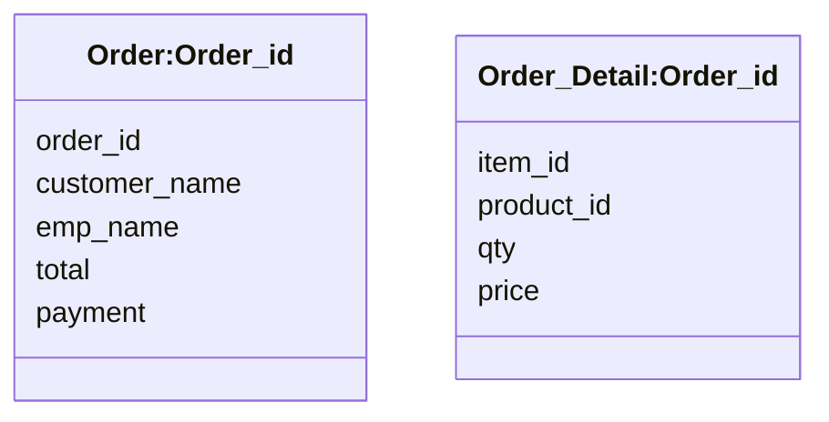
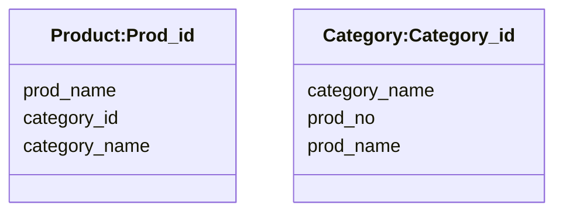
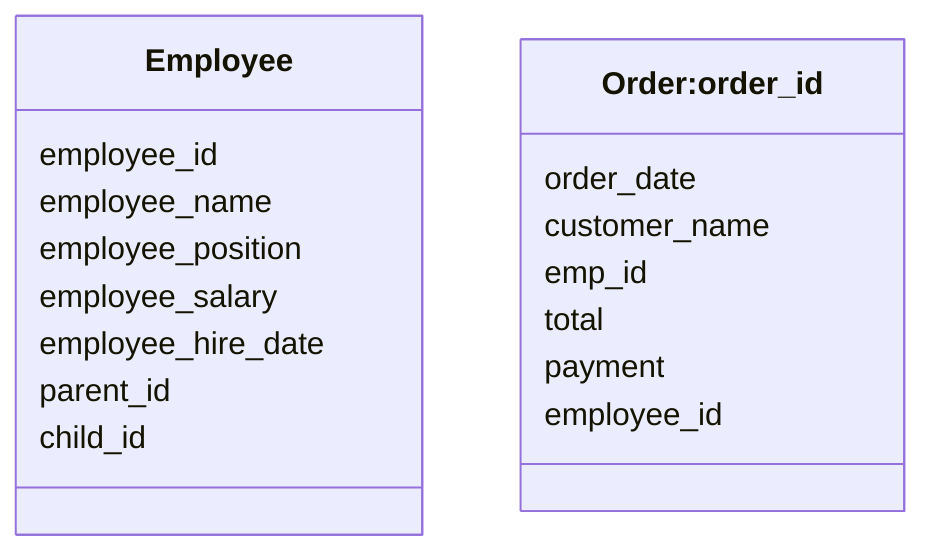

Redis DB에서 설계 가능한 데이터 모델 유형들과 실제 구현 방법에 대해 정리해 보겠습니다.
Redis 서버에서 설계할 수 있는 데이터 모델 유형은 크게 5가지가 있습니다.

- Hash-Hash Data Model
- Hash-List Data Model
- List-List Data Model
- Set/Sorted Set-List Data Model
- HyperLogLogs Data Model

# Hash-Hash Data Model

주문 테이블과 운송 테이블은 대표적인 Hash-Hash 테이블로 설계될 수 있는 테이블 구조입니다.
이를 Redis 데이터 모델 표기법(Notation)으로 표현하면 다음과 같습니다.

아래의 두 직사각형은 주문 테이블과 운송 테이블로 [Object 명]과 [Key]로 표현 할 수 있습니다.
주문 테이블은 order:order_id로 운송 테이블은 translate:order_id로 표기할 수 있습니다.



이와 같은 구조를 Redis DB의 Hash-Hash 데이터 모델이라고 표현할 수 있습니다.

```bash
> hmset order:201809123 customer_name "Wonman & KT" emp_name "Magie" total 45000 payment "Credit"
> hgetall order:201809123
> hmset translate:201809123 translate_id 12670 translate_date "2018-09-23" translate_status "Complete"
> hgetall translate:201809123
```

# Hash-List Data Model

주문 테이블과 주문 상세 테이블은 대표적인 Hash-List 테이블로 설계될 수 있는 테이블 구조입니다.
이를 Redis 데이터 모델 표기법(Notation)으로 표현하면 다음과 같습니다.

아래의 두 직사각형은 주문 테이블과 주문 상세 테이블로 [Object 명]과 [Key]로 표현 할 수 있습니다.
주문 테이블은 order:order_id로 주문 상세 테이블은 order_detail:order_id로 표기할 수 있습니다.
이를 Redis DB의 테이블로 생성하고 List 데이터 구조로 관리할 수 있습니다.



```bash
> hmset order:201809123 customer_name "Wonman & KT" emp_name "Magie" total 45000 payment "Credit"
> hgetall order:201809123
> lpush order_detail:201809123 "<item_id>1</item_id><product_id>1001</product_id><qty>1</qty><price>1000</price>"
> lpush order_detail:201809123 "<item_id>2</item_id><product_id>1003</product_id><qty>2</qty><price>4000</price>"
> lrange order_detail:201809123 0 -1
```

# List-List Data Model

제품 테이블과 카테고리 테이블은 대표적인 List-List 테이블로 설계될 수 있는 테이블 구조입니다.
이 데이터 구조는 관계형 데이터베이스에는 존재하지 않는 N:M 관계 구조로 표현할 수 있습니다.

아래의 두 직사각형은 제품 테이블과 카테고리 테이블로 [Object 명]과 [Key]로 표현 할 수 있습니다.
제품 테이블은 product:prod_id로 카테고리 테이블은 category:category_id로 표기할 수 있습니다.
제품 테이블의 prod_no와 카테고리 테이블의 category_id는 연결고리(Link)로 사용되고 있습니다.



```bash
> lpush product:1001 "prod_name: 'Apple', category: [cname1: c1000, cname2: c2000]"
> lrange product:1001 0 -1
> lpush category:c1000 "category_name: 'Tablet', products: [pname1: 1001, pname2: 1002]"
> lrange category:c1000 0 -1
```

# Set/Sorted Set-List Data Model

일반적으로 관계형 DB는 하나의 테이블과 관계되는 상대 테이블을 식별키(Priamry Key)와 외부키(Foreign Key)로 표현할 수 있으며 이를 통해 데이터 무결성을 보장할 수 있는 데이터 구조로 설계할 수 있습니다.
그런데 하나의 테이블과 관계되는 상대 테이블이 자기 자신이 될 수도 있는 데이터 구조를 계층 구조(Tree Structure) 테이블이라고 표현합니다.
Redis DB에서도 이와 같은 데이터 구조를 설계할 수 있는데 이를 Set/Sorted Set 테이블이라고 합니다.

아래 그림에서 왼쪽 직사각형 도형은 직원 테이블이며 오른쪽은 주문 테이블 입니다.



```bash
> sadd employee "employee_id:1001 employee_name: 'Wonman', employee_position: 'CEO', employee_salary: 1000000, employee_hire_date: '2018-01-01', parent_id: 0, child_id: 1002"
    "empoloyee_id: 1002: employee_name: 'man', employee_position: 'finance', employee_salary: 10000, employee_hire_date: '2019-03-02', parent_id: 1, child_id: 1004"
> smemebers employee
```
