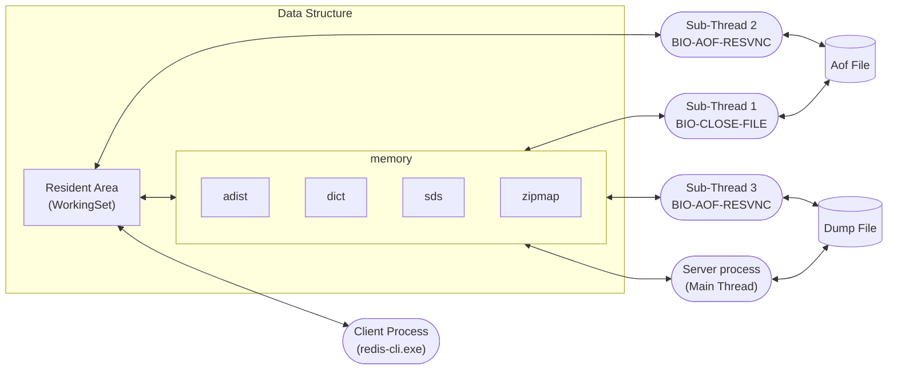

## Redis Architecture

아래의 그림은 Redis 서버의 기본 아키텍처(Redis Standalone Architecture) 구조이며 3가지 영역으로 구성되어 있습니다.



- Memory 영역
- File 영역
- Process 영역

1. Memory 영역

- Resident Area

  사용자가 Redis 서버에 접속해서 처리하는 모든 데이터가 가장 먼저 저장되는 영역입니다.
실제 작업이 수행되는 공간이고 WorkingSet 영역이라고 표현합니다.

- Data Structure  

  Redis 서버를 운영하다 보면 발생하는 다양한 정보와 서버 서버 상태를 모니터링하기 위해 수집한 상태 정보를 저장하고 관리하기 위한 메모리 공간이 필요합니다.
이러한 정보들은 Redis 서버의 메모리 영역에 저장되며, 이러한 정보들을 Data Structure 라고 표현합니다.

2. File 영역

- AOF(Append Only File)

  Redis는 모든 데이터를 메모리 상에 저장하고 관리하는 In-Memory 기반의 데이터 처리 기술을 제공합니다.
하지만 중요한 데이터의 경우 사용자의 필요에 따라 지속적으로 저장해야 할 필요가 있는데 이를 위해 제공되느 디스크 영역이 AOF(Append Only File) 입니다.(스냅샷 데이터)

- DUMP File

  AOF 파일과 같이 사용자 데이터를 디스크 상에 저장할 수 있지만 소량의 데이터를 일시적으로 저장할 때 사용하는 파일입니다.

3. Process 영역

- Server Process

  redis-server.exe 또는 redis-sentinel.exe 실행 코드에 의해 활성화되는 프로세스를 서버 프로세스라고 하며 Redis 인스턴스를 관리해 주며 사용자가 요구한 작업을 수행하는 프로세스 입니다.
Redis Server 프로세스는 4개의 멀티 쓰레드로 구성되는데 main thread, sub thread 1(BIO-Close-File), sub thread 2(BIO-AOF-Resync), sub thread 3(BIO-Lazy-Free)로 구성되어 있습니다.

- Client Process

  redis-cli.exe 또는 사용자 애플리케이션에 의해 실행되는 명령어를 실행하기 위해 제공되는 프로세스 입니다.

# Redis Memory 확인

Redis 서버의 메모리 사용량을 확인하기 위해서는 redis-cli를 실행하고 다음과 같은 명령어를 입력하면 됩니다.

```shell
$ redis-cli -p 5000

> info memory
used_memory:29261104 
used_memory_human:27.91M <- Redis 서버가 현재 사용하고 있는 전체 메모리(used_memory_overhead + used_memory_dataset)
used_memory_rss:42463232
used_memory_rss_human:40.50M <- Redis 서버가 사용중인 실제 메모리 크기(RSS, Resident Set Size)
used_memory_peak:29276336
used_memory_peak_human:27.92M <- Redis 서버의 이전에 가장 많이 사용했던 메모리 최대치
used_memory_peak_perc:99.95% <- Redis 서버가 시작된 이후 가장 많이 사용했던 메모리 대비 현재 사용 중인 메모리의 비율을 퍼센트로 표현
used_memory_overhead:1379680 <- Redis 서버가 동작하기 위해 필요한 메모리(byte)
used_memory_startup:898744 <- 최초 할당 되었던 메모리 크기(byte)
used_memory_dataset:27881424 <- 사용자 데이터가 저장된 메모리 크기(byte)
used_memory_dataset_perc:98.30% <- Redis 서버에서 사용자 데이터를 저장하는데 사용하는 메모리가 전체 사용 메모리(used_memory) 대비 차지하는 비율을 퍼센트로 표현
allocator_allocated:30833208 <- Redis 서버가 메모리 할당자로부터 할당받은 메모리의 총량(byte)
allocator_active:38207488 <- Redis 서버가 메모리 할당자로부터 실제로 할당받아 현재 활성화된 메모리의 총량(byte)
allocator_resident:40632320 <- Redis 서버가 메모리 할당자로부터 할당받아서 시스템에 의해 실제로 사용되고 있는 메모리의 총룡(byte)
total_system_memory:8222203904  
total_system_memory_human:7.66G <- Redis 서버가 실행되고 있는 시스템의 총 메모리 크기
used_memory_lua:31744 
used_memory_vm_eval:31744 <- Redis 서버에서 Lua 스크립트를 평가(evaluate)하는 데 사용되는 메모리의 양
used_memory_lua_human:31.00K <- Redis 서버에서 Lua 스크립트 엔진이 사용하는 메모리의 양(byte)
used_memory_scripts_eval:0 <- Redis 서버에서 Lua 스크립트를 평가(evaluate)하는 데 사용되는 메모리의 양
number_of_cached_scripts:0
number_of_functions:0
number_of_libraries:0
used_memory_vm_functions:32768
used_memory_vm_total:64512
used_memory_vm_total_human:63.00K
used_memory_functions:184
used_memory_scripts:184
used_memory_scripts_human:184B
maxmemory:0
maxmemory_human:0B <- Redis 설정에서 사용할 수 있는 최대 메모리 크기, 0이면 제한 없음, 0이 아닌 경우 maxmemory-policy에 따라 메모리를 관리 
maxmemory_policy:noeviction <-Redis 설정에서 메모리가 maxmemory로 설정된 값에 도달했을 때 어떻게 처리할지를 결정하는 설정 
allocator_frag_ratio:1.24
allocator_frag_bytes:7374280
allocator_rss_ratio:1.06
allocator_rss_bytes:2424832
rss_overhead_ratio:1.05
rss_overhead_bytes:1830912
mem_fragmentation_ratio:1.45 <-Redis 서버의 메모리 파편화 비율 
mem_fragmentation_bytes:13202328
mem_not_counted_for_evict:0
mem_replication_backlog:0
mem_total_replication_buffers:0
mem_clients_slaves:0
mem_clients_normal:22400
mem_cluster_links:0
mem_aof_buffer:0
mem_allocator:jemalloc-5.3.0
active_defrag_running:0
lazyfree_pending_objects:0
lazyfreed_objects:0
```

```shell
// 실시간 사용 중인 메모리 크기 확인
$ redis-cli -p 5000 -r 100 -i 1 info | grep used_memory_human:
used_memory_human:27.91M
used_memory_human:27.91M
...
^C // Ctrl + C 중단
```

메모리 영역에 대한 HIT와 MISSES에 대한 확인은 다음과 같이 확인할 수 있습니다.

```shell
$ redis-cli -p 5000

> info stats
# Stats
total_connections_received:2
total_commands_processed:25
instantaneous_ops_per_sec:5
total_net_input_bytes:732
total_net_output_bytes:7785
total_net_repl_input_bytes:0
total_net_repl_output_bytes:0
instantaneous_input_kbps:0.17
instantaneous_output_kbps:1.89
instantaneous_input_repl_kbps:0.00
instantaneous_output_repl_kbps:0.00
rejected_connections:0
sync_full:0
sync_partial_ok:0
sync_partial_err:0
expired_keys:0
expired_stale_perc:0.00
expired_time_cap_reached_count:0
expire_cycle_cpu_milliseconds:2172
evicted_keys:0
evicted_clients:0
total_eviction_exceeded_time:0
current_eviction_exceeded_time:0
keyspace_hits:0 <- Redis에서 키 조회 요청이 성공한 횟수, 값이 높을수록 Redis에서 데이터 조회가 빈번하게 성공하고 있다는 것을 의미
keyspace_misses:0 <-Redis에서 키 조회 요청이 실패한 횟수, 값이 높을수록 Redis에서 데이터 조회가 빈번하게 실패하고 있다는 것을 의미
pubsub_channels:0
pubsub_patterns:0
pubsubshard_channels:0
latest_fork_usec:0
total_forks:0
migrate_cached_sockets:0
slave_expires_tracked_keys:0
active_defrag_hits:0
active_defrag_misses:0
active_defrag_key_hits:0
active_defrag_key_misses:0
total_active_defrag_time:0
current_active_defrag_time:0
tracking_total_keys:0
tracking_total_items:0
tracking_total_prefixes:0
unexpected_error_replies:0
total_error_replies:0
dump_payload_sanitizations:0
total_reads_processed:25
total_writes_processed:23
io_threaded_reads_processed:0
io_threaded_writes_processed:0
reply_buffer_shrinks:3
reply_buffer_expands:1
eventloop_cycles:138785
eventloop_duration_sum:34076667
eventloop_duration_cmd_sum:711
instantaneous_eventloop_cycles_per_sec:13
instantaneous_eventloop_duration_usec:222
acl_access_denied_auth:0
acl_access_denied_cmd:0
acl_access_denied_key:0
acl_access_denied_channel:0
```

Redis 서버 프로세스와 쓰레드 구조를 모니터링하는 방법입니다.
Redis 서버 프로세스는 4개의 멀티 쓰레드로 구성되며 각 쓰레드의 역할은 다음과 같습니다.

1. Main Thread
  Redis 서버에 수행되는 대부분의 명령어와 이벤트를 처리하는 역할을 수행합니다. 
 
2. Sub-Thread 1(BIO-Close-File)
  쓰레드 1은 AOF(Append Only File)에 데이터를 Rewrite 할 때 기존 파일은 Close하고 새로운 AOF 파일에 Write하는 역할을 수행합니다.

3. Sub-Thread 2(BIO-AOF-Resync)
  쓰레드 2는 AOF 쓰기 작업을 수행할 때 사용됩니다.

4. Sub-Thread 3(BIO-Lazy-Free)
  쓰레드3은 UNLINK, FLUSHALL, FLUSHDB 명령어를 수행할 때 빠른 성능을 보장하기 위해 백그라운드에서 실행 됩니다.

```shell
// redis multi-thread 확인
$ ps -eLF | grep redis

// system call 확인
$ strace -p 16310
```

## System 사양

|         내용          |      최소 사양      |                권장 사양                |
| :-------------------: | :-----------------: | :-------------------------------------: |
| # of node per cluster |       2 Cores       |               >= 3 Cores                |
|  # of cores per node  |       3 Cores       |               >= 8 Cores                |
|          RAM          |        15GB         |                 >= 30GB                 |
|        Storage        | SATA(RAM 크기 * 10) |                  40GB                   |
| Persistentce Storage  |    RAM 크기 * 3     | >= RAM 크기 * 6 \n (>= RAM + Flash * 5) |
|        Network        |         1G          |                 >= 10G                  |

서버의 사양을 어떻게 결정할 것인가?

## 노드 수(# of node per cluster)

하나의 standalone 서버를 구축하는 경우에 master 서버 1대, slave 서버 1대 그리고 FailOver와 Load Balancing을 위한 Sentinel 서버 1대를 구축하는 경우 최소 3대의 서버가 요구 됩니다.
